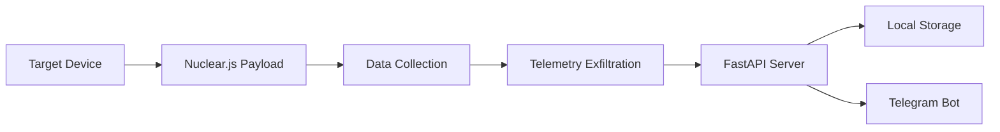

# ZeroEye v2.0 - Advanced Reconnaissance Framework

<div align="center">

<div align="center">


<br>


</div>
<br>

**A next-generation reconnaissance framework for authorized security testing and red team operations**

*"Knowledge is power, but responsibility is key"*

</div>

---

## ⚠️ Critical Legal Disclaimer

> [!IMPORTANT]
> **WARNING: STRICTLY FOR LEGAL USE ONLY**

**ZeroEye v2.0 is developed exclusively for:**
- ✅ Authorized penetration testing
- ✅ Educational cybersecurity research
- ✅ Law enforcement investigations (with proper warrants)
- ✅ Corporate security assessments (with written permission)

**STRICTLY PROHIBITED:**
- ❌ Unauthorized access to systems
- ❌ Privacy violations without consent
- ❌ Illegal surveillance activities
- ❌ Malicious attacks on unauthorized targets

> **DEVELOPER LIABILITY:** > The creator (**Zero Haven**) assumes **NO** responsibility for misuse. Users are solely liable for ensuring compliance with local laws. By using this tool, you agree to use it **ONLY** on systems you own or have explicit written permission to test.

> **LEGAL CONSEQUENCES:** > Unauthorized use may result in severe criminal penalties including:
> - Computer Fraud and Abuse Act violations
> - Privacy law violations
> - Civil and criminal liability

---

## 🚀 Overview

**ZeroEye v2.0** is an advanced web-based reconnaissance framework designed for **authorized red team engagements** and **educational security research**. It demonstrates modern client-side data collection techniques to help organizations understand their digital exposure risks.


## 
#  Feature--------------Description
- 📸 Visual Intelligence>        Cross-browser camera capture capabilities
- 🎙️ Audio Intelligence>         Ambient audio recording capabilities
- 📍 Geolocation>                High-precision GPS positioning
- 🌐 Network Intelligence>       WebRTC internal IP discovery
- 🖥️ System Profiling>           Comprehensive device fingerprinting
- MANY MORE CAN'T TELL JUST TRY AND ENJOY
##
 #  ⚡ Advanced Architecture
- Self-Hosted: Zero external dependencies

- Real-time Exfiltration: Dual-channel data transmission

- Stealth Operation: Minimal footprint detection

- Cross-Platform: Compatible with all modern browsers
##
# 💿 Installation Guide
- Prerequisites
- Kali Linux 2023+ (Recommended)
- Python 3.8+
- Internet connection for tunnel setup
##
#  Step-by-Step Installation
```
1. Clone the repository
git clone https://github.com/zerohaven-ops/ZeroEye
cd ZeroEye

2.CRITICAL: Fix Windows line endings (Run this once)
sed -i 's/\r$//' *.sh

 3. Run the automated installer
chmod +x install.sh
./install.sh

 4. Start ZeroEye (Choose one method)
python3 zeroeye.py          # Recommended - auto venv
 OR
./start.sh                  # Alternative method

5. If you face any error then remove the tool with
sudo rm -rf ZeroEye
Then Install Again with Steps Given Above

Verification StepsBash# Check virtual environment creation
ls -la zeroeye_venv/        

 Verify dependencies
python3 zeroeye.py --check

```
# ⚙️ Operational Guide
**1. Telegram Bot Setup**
- Search for @BotFather in Telegram.
- Send /newbot command.
- Follow setup instructions.
- Copy the API Token provided.
- Search for @userinfobot to get your Chat ID.
##
**2. ZeroEye Configuration**
 Example configuration flow
- Enable Telegram? (y/n): y
- Bot Token: 1234567890:ABCdefGHIjklMNopQRstuVWXyz
- Chat ID: 987654321
- Select Template (1-3): 1
- Tunnel Method (1): 1
  ##
**3. Target Engagement**
- HTTP
- Generated URL: [https://random-string.trycloudflare.com](https://random-string.trycloudflare.com)
- Send this to authorized target for testing.
##

# 🎯 Use Cases (Authorized Only)
**🏢 Corporate Security**
- Employee security awareness training
- Phishing simulation exercises
- Internal threat assessment
- Security control validation

**🔬 Academic Research**
- Browser security research
- Privacy vulnerability studies
- Client-side attack vector analysis
- Cybersecurity education

**⚖️ Legal & Law Enforcement**
- Authorized forensic investigations
- Court-ordered surveillance
- National security operations
- (With proper legal documentation)
  ##
  ##
  
# 🔧 Technical Specifications
# **Backend Stack**
- Framework: FastAPI + Uvicorn
- Tunneling: Cloudflared reverse proxy
- Notifications: Telegram Bot API
- Data Storage: Local filesystem + Telegram

# Client Payload (nuclear.js)
- Compatibility: Chrome, Firefox, Safari, Edge
- Techniques: WebRTC, MediaDevices API, Geolocation API
- Stealth: Progressive permission escalation
- Resilience: Cross-browser fallback mechanisms
  ##

# 🤝Contributing
**We welcome contributions from security researchers and developers:**
- Fork the repository.
- Create a feature branch.
- Submit a pull request.
- Include comprehensive tests.
- Update documentation.

**Contribution Guidelines:**
- Code must include security safeguards.
- No backdoors or hidden features.
- Clear documentation required.
- Ethical use enforcement.
- legal compliance verification.
##

# **📜 License**
- This project is licensed under the MIT License.
- MIT License - Permissions include commercial use, modification, distribution.
- Condition: License and copyright notice must be included.
- No Liability: Software provided "as is" without warranty.

# **🆘 Support & Resources**
- Educational Resources
- OWASP Testing Guide
- Penetration Testing Execution Standard
- NIST Cybersecurity Framework
- Responsible Disclosure: Found a vulnerability? Contact TG:@Zero_Haven
  ##

<div align="center">
<br>
  
 **Remember: With great power comes great responsibility**

**ZeroEye v2.0 - For a more secure digital world**

</div>
